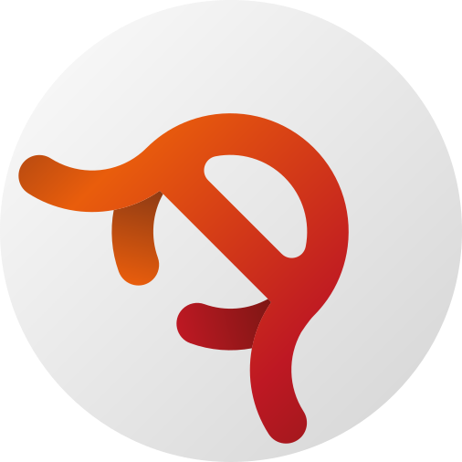

  

# 
Ядро НБМ (API, Rust (Проект Octopus)

Исходный код ядра, то бишь API, Народного Банка Мемов, сердца экономики Мемного мира

## Технологический стек
| Для чего? | Технология |
| :--- | :--- |
| **Язык программирования** | Rust |
| **Runtime** | Теперь его нет |
| **База данных** | PostgreSQL |
| **Архитектура** | Монолитная, основанная на сервисах, отдельно сервер авторизации |
| **Лицензия** | GNU AGPLv3 |